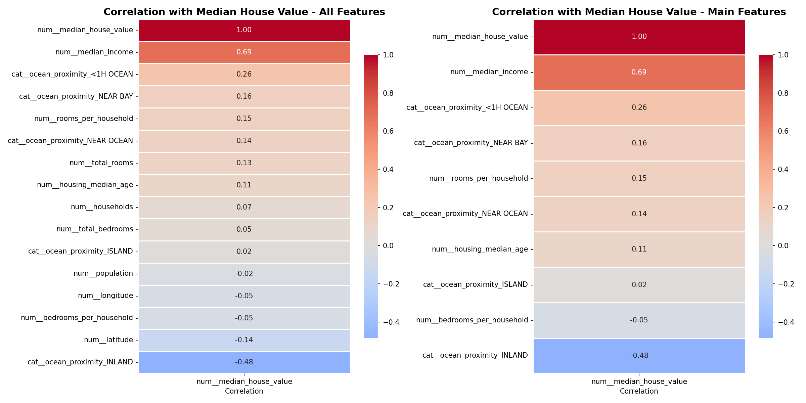
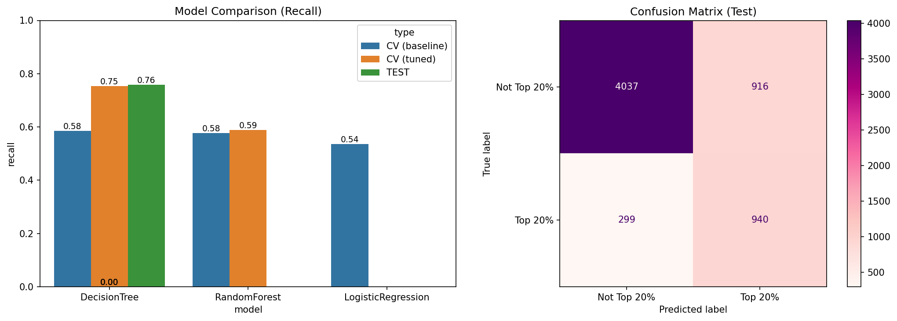
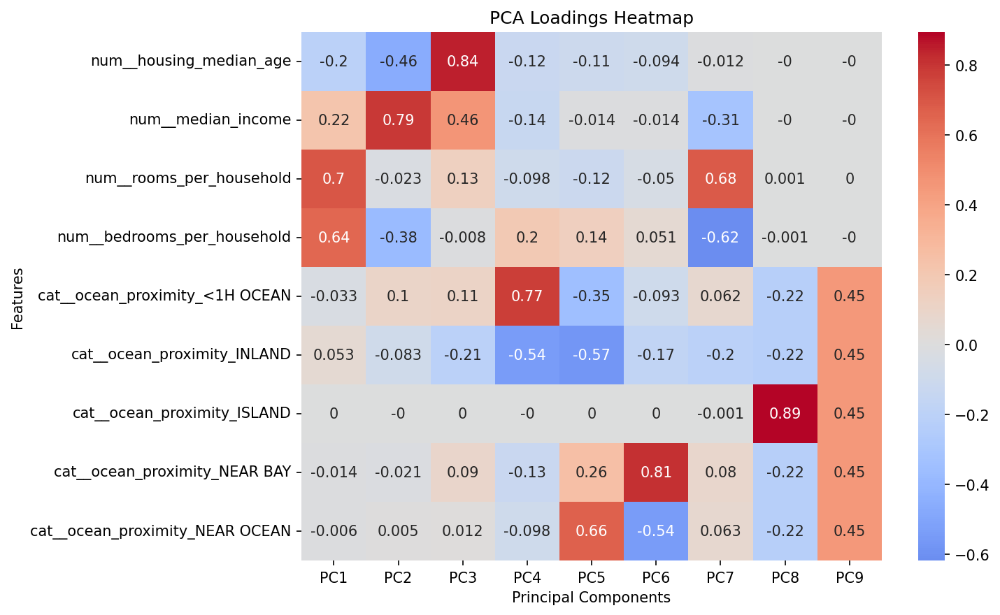

# Case: California Housing – modellering som beslutsunderlag
**Student:** Wendy Mermet (Python version 3.11.9)
---
## 1) Mål och valt spår
Kunden vill kunna snabbt bedöma om ett nytt område sannolikt är ett högprisområde, baserat på tillgängliga egenskaper som geografi, hushåll och inkomstnivåer.  
- **Spår B – Klassificering (identifiera högprisområden):** Jag valde klassificering eftersom jag tycker det är mer intressant att arbeta med, och det är en metod som ofta används i affärssammanhang för att prioritera resurser och fatta beslut baserat på sannolikheter.  
- **Mål:**  
  - Skapa binär target (`high_value`) – topp 20% = 1, övriga = 0  
  - Träna modell endast på övriga features, utan `median_house_value`  
  - Prioritera resurser genom att identifiera högprisområden  
  - Minimera risken att missa ett högprisområde
---
## 2) Kort data-insikt (EDA)
- Saknade numeriska features → median  
- Saknade kategoriska features → mest frekvent  
- Targetfördelning: 20% positiv, 80% negativ (obalanserad)  
- Fokus på recall för att minimera falska negativa  

---
## 3) Metod (ML-flöde)
- Skapande av nya features (`rooms_per_household`, `bedrooms_per_household`) och målvariabeln som indikerar topp 20% av husvärdena  
- Datan delas i X och y, sedan i tränings- och testset med `stratify=y`  
- Transformatorer och skalare appliceras på numeriska och kategoriska features, irrelevanta features tas bort  
- Tre modeller tränas via pipelines – Logistic Regression (baseline), Decision Tree och Random Forest – med 5-faldig CV och `recall` som metric  
- Bästa modellerna optimeras med GridSearchCV, slutmodellen väljs baserat på optimala parametrar och utvärderas på testdata med samma preprocessing för att undvika dataläckage
---
## 4) Resultat
- **Jämförelse av modeller:**  
  - Baseline: Decision Tree & Random Forest bäst (recall ~0.58), Logistic Regression lägst (~0.54)  
  - Efter tuning: **Decision Tree bäst med recall 0.754**  
- **Resultat efter tuning:**  
  - Störst förbättring jämfört med baseline  
  - Stabil recall ~0.75 → identifierar majoriteten av högprisområden  

---
## 5) Rekommendation
- **Vald modell:** Decision Tree  
- **Bästa parametrar:**  
    `| class_weight | criterion | max_depth | max_features | min_samples_leaf | min_samples_split |`
    `| balanced     | entropy   | 10        | log2         | 6                | 2                 |`
- **Resultat:**  
  - CV Recall (tuned): 0.754  
  - Test Recall: 0.759, Accuracy: 0.804, Precision: 0.506, F1: 0.607  
- **Motivering:**  
  - Högst recall på både CV och testdata  
  - Fokuserar på att minimera falska negativa  
  - Tolkbar modell → möjlighet att analysera fel via PCA-komponenter  
  - Applicerbar på nya områden med korrekt preprocessing
---
## 6) Risker och begränsningar
- **Typiska fel:** FN → missar områden där geografi väger tyngre än boendestandard; FP → överskattar områden med stark socioekonomisk signal  
- **Externa risker:** Historiska data fångar inte stadsplanering, marknadstrender, invånares initiativ, politisk stabilitet eller ekonomiska kriser  
- **Fel vid användning:** Dataläckage vid felaktig applicering av Scaller/Transformer före split → överoptimistiska prestanda  
- **Nästa steg:** Inkludera fler externa faktorer, testa alternativa modeller, säkerställa korrekt pipeline
---
## 7) Oövervakad inlärning
- **Definition:** Algoritmen hittar mönster utan target  
- **Syfte:** Förstå områdesstruktur, identifiera grupper och avvikare  
- **Verktyg:** PCA → reducerar dimensioner, KMeans → grupperar observationer  
- **PCA-resultat:** PC1–PC4 → 92,7% av variationen; PC1: `rooms_per_household`, `bedrooms_per_household`; PC2: `median_income`, `housing_median_age`; PC4: `ocean_proximity`  

---
## 8) Självreflektion
- **Styrkor:** Förmåga att systematiskt gå igenom problemet, fokusera på ett tydligt mål och presentera resultat på ett lättförståeligt sätt 
- **Svårast:** Visualisering och tolkning av PCA-komponenter; säkerställa korrekt features genom hela pipeline  
- **Självskattning:** **VG** – alla G-krav uppfyllda; extra VG-krav genomförda (oövervakad inlärning, fördjupad analys, kritisk diskussion)